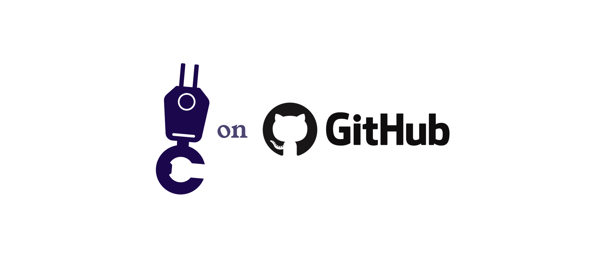

**Human-Centric Agency • Agentic AI • Personified User Interfaces**

---

## 🎯 The Mission

We're building the future of human-AI collaboration through **human-centric agency**—autonomous systems that feel like natural team members rather than complex machinery. Our research and open-source projects focus on creating AI agents that you can trust, relate to, and work alongside as genuine digital colleagues.

## 🧬 Our Philosophy: The Biological Organism Model

Just as your body operates through specialized systems working in harmony—your immune system handles threats, your nervous system coordinates responses, your digestive system processes resources—we design AI agencies that function the same. Each specialized agency can handle distinct responsibilities while contributing to a coherent, self-sustaining whole.

The breakthrough comes in the interface layer: instead of managing technical systems through dashboards and commands, you coordinate with **personified AI agents** that look you in the eye, express concern about emerging issues, and smile with satisfaction when problems get resolved.

## 🚀 What We're Building

### **openribcage** - A2A Protocol Client for Avatar Interfaces
**🔗 [craine-io/openribcage](https://github.com/craine-io/openribcage)**

The foundational layer enabling avatar-based AI agent coordination through the Google-backed Agent2Agent (A2A) protocol. Think of it as the nervous system that lets you communicate naturally with your digital organism.

- **Standards-Based**: Full A2A protocol compliance for universal agent communication
- **Framework Agnostic**: Works with kagent, LangGraph, CrewAI, and any A2A-compliant system
- **Avatar Ready**: Bridges technical agent frameworks with human-like interfaces
- **Enterprise Scale**: Built for production environments with security and observability

### **Project AAMI** - Avatar Agency Management Interface
**🔒 Private Development**

The personified user interface layer that transforms AI agent coordination from technical complexity into natural conversation. Currently in stealth development.

- **Conversational Coordination**: Talk to your agents like colleagues, not commands
- **Dynamic Adaptation**: Interfaces that reshape based on conversation context
- **Multi-Agency Orchestration**: Coordinate teams of specialized agents seamlessly
- **Trust-Centered Design**: Transparent operations with thoughtful human oversight

## 🎪 The Technology Stack

```
┌─────────────────────────────────────────────────────────────────┐
│                    Personified User Interfaces                  │
│          (Avatar-based coordination and conversation)           │
├─────────────────────────────────────────────────────────────────┤
│               Human-Centric Agency Framework                    │
│         (Multi-agent orchestration with human oversight)        │
├─────────────────────────────────────────────────────────────────┤
│           A2A Protocol Layer (openribcage)                      │
│      (Standardized agent discovery and communication)           │
├─────────────────────────────────────────────────────────────────┤
│              Agent Frameworks & Tools                           │
│        (kagent, LangGraph, CrewAI, MCP integrations)            │
├─────────────────────────────────────────────────────────────────┤
│              Cloud-Native Infrastructure                        │
│               (Kubernetes, observability, security)             │
└─────────────────────────────────────────────────────────────────┘
```

## 🌟 Core Principles

### **Transparency Over Black Boxes**
Like Tony Stark's arc reactor visible through his chest plate, our AI systems operate with radical transparency. You can see what they're thinking, understand their reasoning, and trust their decision-making process.

### **Conversation Over Configuration**
Instead of learning technical syntax and memorizing command patterns, you coordinate with AI agents through natural conversation. "Can you check what's causing that latency spike in the payment service?" becomes a simple request to your Engineering Agency.

### **Open Over Proprietary**
We believe the future of AI should be transparent, auditable, and community-driven. Our core technologies are open-source, enabling innovation and preventing vendor lock-in.

## 📚 Research & Publications

Our approach is grounded in research that bridges technical innovation with human psychology:

- **["The Age of AgentOps"](https://craine.io/research)** - Our foundational paper on autonomous infrastructure management
- **["Agents with Faces"](https://medium.com/craine-operators-blog/agents-with-faces-the-personified-user-interface-c4664234d619)** - Research on personified user interfaces and avatar-based coordination
- **["How AI Models Fake Alignment"](https://medium.com/@craineboss/how-ai-models-fake-alignment-and-why-you-should-care-9219391d08f5)** - Critical analysis of trust and transparency in AI systems
- **["Building Your Agencies"](https://medium.com/me/stats/post/3a55914938c9)** - Practical implementation guide for agentic infrastructure

## 🤝 Collaboration & Partnerships

### **Solo.io Partnership**
Active collaboration on the AIRE Framework, building production-ready AI reliability engineering capabilities with the kagent ecosystem.

### **Open Source Community**
Contributing to and building upon:
- **kagent** - Kubernetes-native agent framework
- **A2A Protocol** - Google's Agent2Agent communication standard
- **MCP** - Model Context Protocol for tool integration

## 🚀 Get Involved

### **For Developers**
- **Contribute to openribcage**: Help build the A2A protocol foundation
- **Join AIRE development**: Participate in our livestream development sessions
- **Explore example agents**: See practical implementations in action

### **For Organizations**
- **Pilot programs**: Early access to human-centric agency implementations
- **Consulting services**: Custom agent development and deployment strategies
- **Research collaboration**: Joint development of industry-specific solutions

### **For Researchers**
- **Avatar interface studies**: Human factors research on personified AI interaction
- **Trust in AI systems**: Transparency and explainability research
- **Agentic system design**: Multi-agent coordination and governance patterns

## 💬 Connect With Us

- **Website**: [craine.io](https://craine.io)
- **Research**: [craine.io/research](https://craine.io/research)
- **Discord**: [Join our community](https://discord.gg/nFzG54FG)
- **Livestreams**: [Subscribe to our YouTube channel](https://www.youtube.com/@craine_io)
- **Email**: [hello@craine.io](mailto:hello@craine.io)

## 🎭 Meet the Team

**Jason Clark** - *Founder & Principal Researcher*
- 20+ year veteran of infrastructure automation and cloud computing
- Author of "The Age of AgentOps" and leading Agentic AI Research
- Previously: Duke Health, IBM, Red Hat, Cisco
- **GitHub**: [@craineboss](https://github.com/craineboss)

## 🔮 The Vision

We're 24-36 months away from a world where your infrastructure genuinely takes care of itself, where complex business processes run through natural conversation with AI colleagues, and where the barrier between human intent and system execution disappears entirely.

When your Engineering Agency can look concerned about emerging performance issues, when your Marketing Agency gets visibly excited about campaign results, when your Operations Agency can express confidence about compliance status—you're not just using software. You're collaborating with digital teammates who understand your context, share your goals, and contribute specialized expertise to collective success.

**The future isn't about building better tools—it's about creating better relationships with the autonomous systems that run our world.**

---

*Transform complex multi-agent coordination into natural conversation through human-centric agency.*

**[Explore Our Work](https://github.com/craine-io)** • **[Read Our Research](https://craine.io/research)** • **[Join the Community](https://www.youtube.com/@craine_io)**
